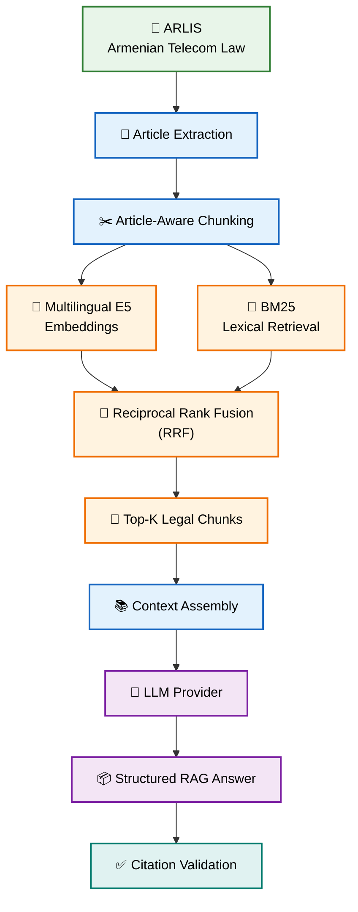
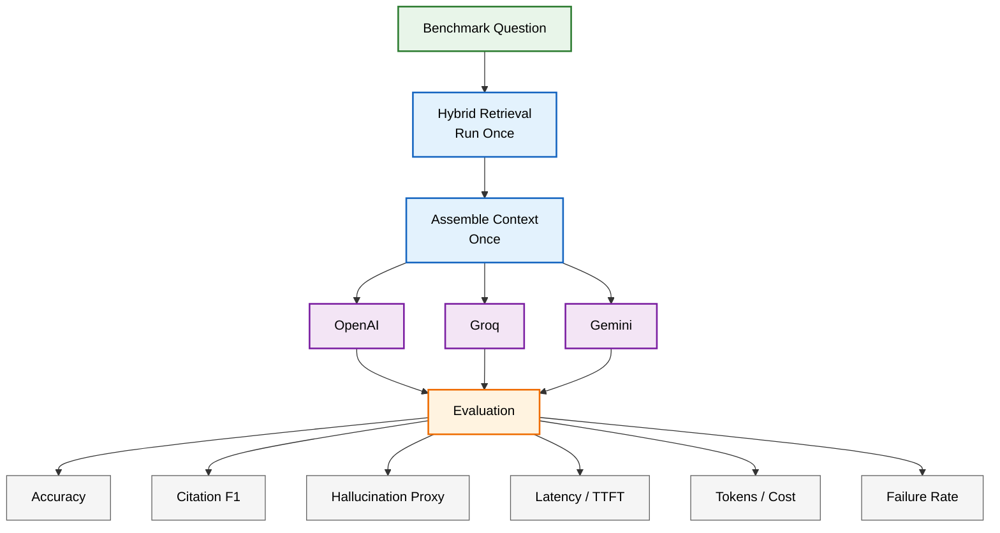

# Armenian Legal RAG Assistant

A multilingual Retrieval-Augmented Generation (RAG) assistant for the
**Law of the Republic of Armenia on Electronic Communications**.

The application supports legal/regulatory questions in **Armenian and English**,
retrieves relevant provisions from the Armenian law, generates grounded answers
with article citations, and benchmarks multiple LLM providers using the same
retrieved evidence.

## Features

- Armenian and English legal Q&A
- Article-aware legal document ingestion
- Multilingual semantic retrieval
- BM25 lexical retrieval
- Hybrid retrieval using Reciprocal Rank Fusion (RRF)
- Structured LLM responses
- Deterministic citation validation
- Out-of-scope question abstention
- OpenAI, Groq, and Gemini benchmark support
- Benchmark metrics for accuracy, citations, hallucination proxy, latency,
  token usage, cost, and failures
- Minimal FastAPI web interface
- Docker support

## Architecture

The RAG pipeline is:



The current corpus contains 67 articles and approximately 126 chunks.

Because the corpus is small, vector retrieval uses normalized embeddings and
exact NumPy search rather than introducing an external vector database.

See [`docs/technical_design.md`](docs/technical_design.md) for the complete
architecture and design rationale.

## Legal Source

The corpus is retrieved from ARLIS:

`https://www.arlis.am/hy/acts/1869`

The system uses the Armenian version of the Law of the Republic of Armenia on
Electronic Communications.

## Retrieval

The system combines two retrieval approaches.

### Semantic retrieval

Model:

```text
intfloat/multilingual-e5-small
```

This enables semantic retrieval across Armenian and English questions.

### Lexical retrieval

BM25 is used to improve retrieval of exact legal terminology.

### Hybrid ranking

The vector and BM25 rankings are combined using Reciprocal Rank Fusion rather
than combining their incompatible raw scores directly.

For interactive queries, the system retrieves 10 candidates and selects the
top 5 chunks for the LLM context.

## Supported LLM Providers

The benchmark integrates:

- OpenAI
- Groq
- Gemini

All providers implement a common interface so that generation is separated
from the RAG pipeline.

For each benchmark question, retrieval is executed once and the same assembled
context is sent to all providers.

## Setup

### 1. Clone the repository

```bash
git clone <repository-url>
cd armenian-legal-rag
```

### 2. Create a virtual environment

```bash
python -m venv .venv
source .venv/bin/activate
```

### 3. Install dependencies

```bash
pip install -r requirements.txt
```

### 4. Configure API keys

Copy the example environment file:

```bash
cp .env.example .env
```

Then add your API keys:

```env
OPENAI_API_KEY=...
GROQ_API_KEY=...
GEMINI_API_KEY=...
```

Never commit `.env`.

## Run Locally

Start the FastAPI application:

```bash
python -m uvicorn app.main:app --reload
```

Open:

```text
http://localhost:8000
```

The embedding model is loaded and the legal corpus is indexed during
application startup, so the first startup may take longer.

## Run With Docker

```bash
docker compose up --build
```

Then open:

```text
http://localhost:8000
```

## Web Interface

The application contains two tabs.

### Q&A

Ask a legal/regulatory question in Armenian or English.

The response displays:

- generated answer
- article citations
- retrieved article numbers
- model
- request latency

### Benchmark

Displays aggregated results for OpenAI, Groq, and Gemini.

## Evaluation Dataset

The benchmark dataset is stored at:

```text
data/evaluation_questions.json
```

It contains 15 questions:

- 5 answerable Armenian questions
- 5 answerable English questions
- 3 out-of-scope/adversarial questions
- 2 synthesis questions

## Benchmark Methodology



## Benchmark Results

| Metric | OpenAI | Groq | Gemini |
|---|---:|---:|---:|
| Successful requests | 15/15 | 15/15 | 12/15 |
| Answer accuracy | 100.0% | 100.0% | 80.0% |
| Citation F1 | 97.8% | 100.0% | 71.1% |
| Hallucination proxy | 0.0% | 0.0% | 0.0% |
| Failure rate | 0.0% | 0.0% | 20.0% |
| Avg total latency | 3356 ms | 5706 ms | 4302 ms |

Gemini's 80% end-to-end accuracy was affected by three API failures. Therefore,
it should not be interpreted as evidence that its successfully generated
answers were necessarily less accurate.

Similarly, 100% automated answer accuracy should not be interpreted as 100%
human-reviewed legal correctness.

See:

```text
reports/evaluation_report.pdf
```

for the complete evaluation.

## Evaluation Outputs

```text
data/benchmark_results.json
data/benchmark_scored.json
data/benchmark_summary.json
```

These preserve raw and processed benchmark results rather than reporting only
aggregated metrics.

## API Endpoints

### Health

```text
GET /api/health
```

### Ask a question

```text
POST /api/ask
```

Example request:

```json
{
  "question": "What is an electronic communications network?"
}
```

### Benchmark summary

```text
GET /api/benchmark
```

### Raw scored benchmark data

```text
GET /api/benchmark/raw
```

## Project Structure

```text
armenian-legal-rag/
├── app/
│   ├── evaluation/
│   ├── ingestion/
│   ├── llm/
│   ├── models/
│   ├── rag/
│   ├── retrieval/
│   └── main.py
├── data/
│   ├── evaluation_questions.json
│   ├── benchmark_results.json
│   ├── benchmark_scored.json
│   └── benchmark_summary.json
├── docs/
│   └── technical_design.md
├── reports/
│   └── evaluation_report.pdf
├── static/
│   ├── index.html
│   ├── style.css
│   └── app.js
├── .env.example
├── Dockerfile
├── docker-compose.yml
├── requirements.txt
└── README.md
```

## Known Limitations

- Embeddings are rebuilt when the application restarts.
- Long articles use character-based splitting rather than clause-aware
  legal chunking.
- BM25 does not perform Armenian morphological normalization.
- Retrieval quality is not independently evaluated with Recall@K or MRR.
- Semantic answer similarity is not equivalent to human legal correctness.
- The hallucination metric is a proxy rather than claim-level entailment.
- TTFT is unavailable for provider integrations currently using non-streaming
  structured output.
- Groq token usage was unavailable in the current streaming integration.
- Free-tier API limits affected some Gemini benchmark requests.

## Production Improvements

With more time, the main improvements would be:

- persistent document and vector indexing
- versioned legal-document ingestion
- clause-aware chunking
- Armenian lexical normalization
- retrieval Recall@K/MRR evaluation
- reranking
- claim-level groundedness evaluation
- provider fallback and circuit breaking
- caching
- authentication and authorization
- observability
- automated tests and CI/CD
- larger, human-reviewed evaluation dataset

## Disclaimer

This project is an engineering prototype for legal information retrieval and
LLM evaluation. Generated responses should not be treated as professional
legal advice.